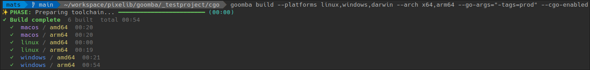

<p align="center">
  
</p>

# Goomba [](https://github.com/pixelib/goomba/actions/workflows/ci.yml)

Golang is *great* at cross compilation, but it completely falls appart when you need to compile with cgo (`CGO_ENABLED=1`) because it then requires to have target specific toolchains and SDK's.

Goomba solves this problem entirely, by automatically managing portable dependencies to compile anything for anywhere (yes, including cgo for macOS hosts regardles of architecture). It also provides a simple CLI to run builds in parallel with a nice progress output.
It's so easy to run, that you don't even need to have Go installed on your machine, and it works the same on Windows, macOS and Linux.

Simply put, it's the perfect matrix build tool for in CI/CD pipelines and local development.

| hosts ↓ / Targets → | Windows x64 | Windows ARM64 | macOS x64 | macOS Apple silicon | Linux x64 | Linux ARM64 |
|---------------------|---|---|-----------|---------------------|---|---|
| Windows             | Yes | Yes | Yes *     | Yes *               | Yes | Yes |
| macOS               | Yes | Yes | Yes *     | Yes *               | Yes | Yes |
| Linux               | Yes | Yes | Yes *     | Yes *               | Yes | Yes |

 <sup> * only if Goomba itself has been compiled on macOS (interl or Apple silicon). You can download a compatible ready-made binary on the releases page.</sup>

Quick example:
> `goomba build --platforms linux,windows,darwin --arch x64,arm64 --go-args="-tags=prod"`
> 

## goals
- single binary, no required system tools besides what goomba downloads
- build matrix support for platforms and architectures
- optional tui progress and parallel builds
- predictable output layout under ./dist (or --out)

## Install

**macOS / Linux**
```sh
curl -fsSL https://raw.githubusercontent.com/pixelib/goomba/refs/heads/main/install.sh | bash
```

**Windows (PowerShell)**
```powershell
irm https://raw.githubusercontent.com/pixelib/goomba/refs/heads/main/install.ps1 | iex
```

## usage

```
goomba build [flags] [-- <go build args>]
```

Help is available with:

```
goomba --help
goomba help
goomba build --help
```

### examples

```
goomba build --platforms linux,macos,windows
```

```
goomba build --platforms macos --arch x64,arm64
```

```
goomba build -- --buildmode=c-shared -o dist/libshared.so
```

```
goomba build --out ../dist
```

### flags

- --platforms: comma separated list of linux, macos, windows
- --arch: comma separated list of amd64, arm64, x64
- --no-parallel: run builds one by one
- --no-tui: disable tui progress output (intended for CI environments)
- --no-validation: skip validation step
- --strict: fail if any target fails and remove output directory
- --verbose: enable verbose logging
- --java-home: override JAVA_HOME for JNI includes
- --out: output base directory (default: dist, supports ../ paths)
- --go-args: append go build args, repeatable
- --cgo-enabled: enable CGO support and handle special platform dependencies, also implies --go-args=CGO_ENABLED=1

By default, failed targets are logged and skipped while the rest continue.
When the tui is enabled, go command output is shown as a temporary, last-10-line log under each progress bar.
With --verbose, goomba keeps a longer log window and prints command and env details per step.

## output layout

Artifacts are placed in:

```
./dist/<platform>/<arch>/<binary>
```

Use --out to change the base directory. Relative paths are resolved from the current working directory and can include .. segments.

## phases

1. preparing golang runtime (if not installed)
2. validation
3. preparing compilers and sdk's
4. build

## dependency handling
- respects host env vars for GOROOT, GOPATH, CGO_ENABLED, CGO_CFLAGS, GO111MODULE, GOWORK, GOPROXY
- if go is missing, goomba downloads it into ~/.goomba/cache or /tmp
- if a c compiler is missing and cgo is enabled, goomba downloads zig and uses it as a c compiler for all platforms, including macos on arm64 hosts where no compatible c compiler is available otherwise

## technical notes

goomba respects these go env variables when set on the host:

- GOROOT
- GOPATH
- CGO_ENABLED
- CGO_CFLAGS
- GO111MODULE
- GOWORK
- GOPROXY

goomba also injects these placeholders for per-target values:

- ${GOOMBA_OS} (go os, for example darwin)
- ${GOOMBA_ARCH} (go arch, for example arm64)
- ${GOOMBA_PLATFORM} (display platform, for example macos)

If JNI headers are needed, set JAVA_HOME or use --java-home to point at a JDK.

## why not goreleaser

goreleaser is focused on release automation, packaging, and publishing. goomba focuses on a fast build matrix with zero local toolchain requirements and no release config. If you only need cross platform builds from any go project root, goomba aims to be lighter weight.

## Caching
goomba caches downloaded dependencies in `~/.goomba/cache` on unix and `%TEMP%\goomba\cache` on windows. This includes the golang runtime and zig compiler, so that they don't need to be downloaded again for subsequent builds.

## Acknowledgements
- [zig](https://ziglang.org/) for providing a portable c compiler that works on all platforms and architectures, making cgo builds possible even on macOS arm64 hosts.
